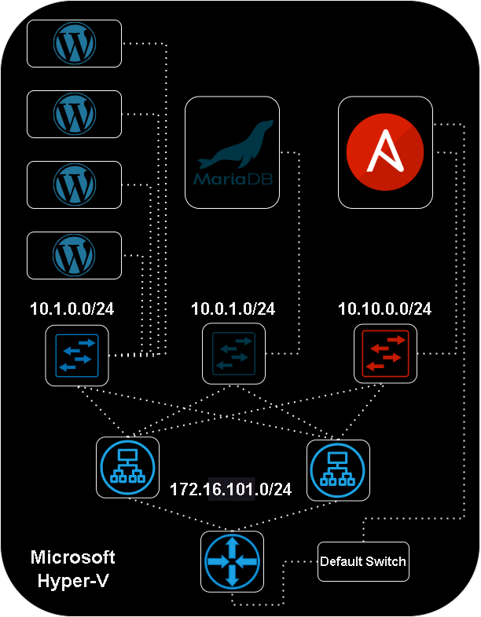
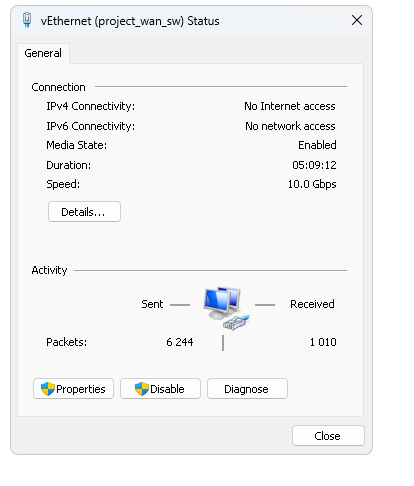
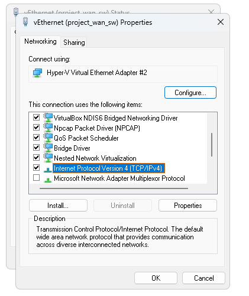
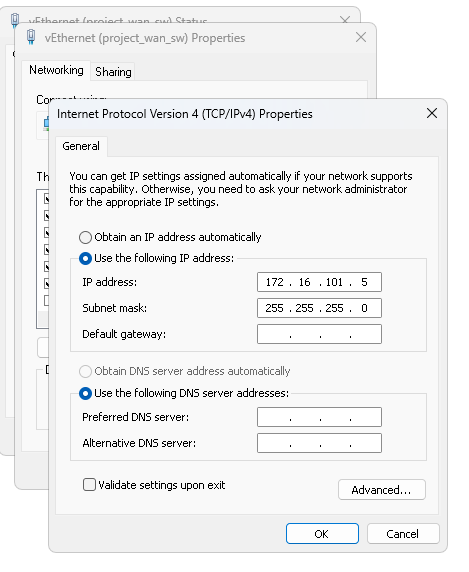
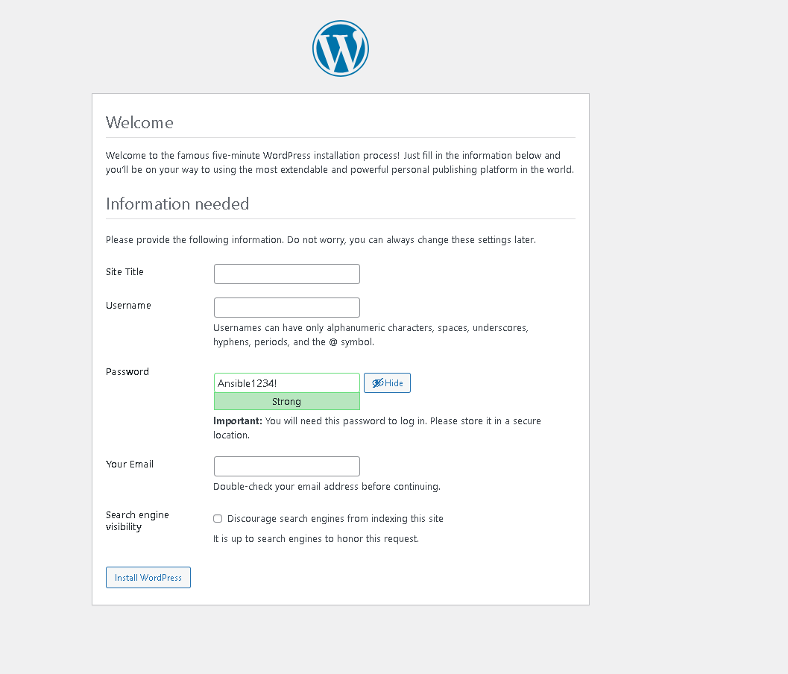
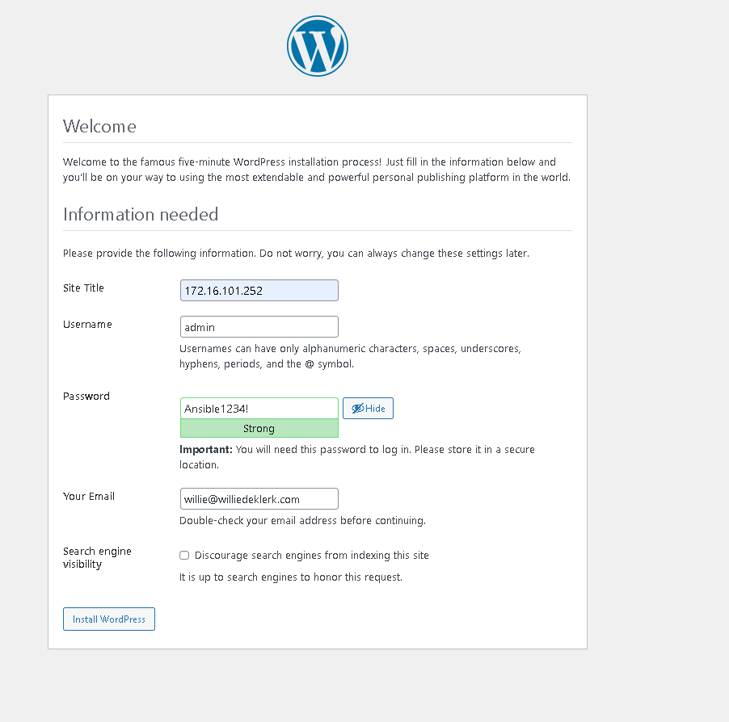
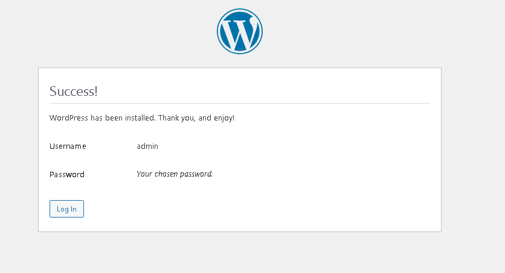
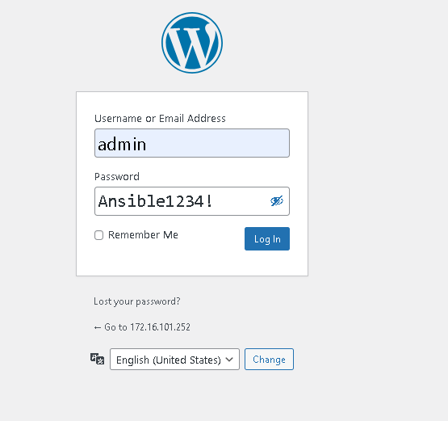
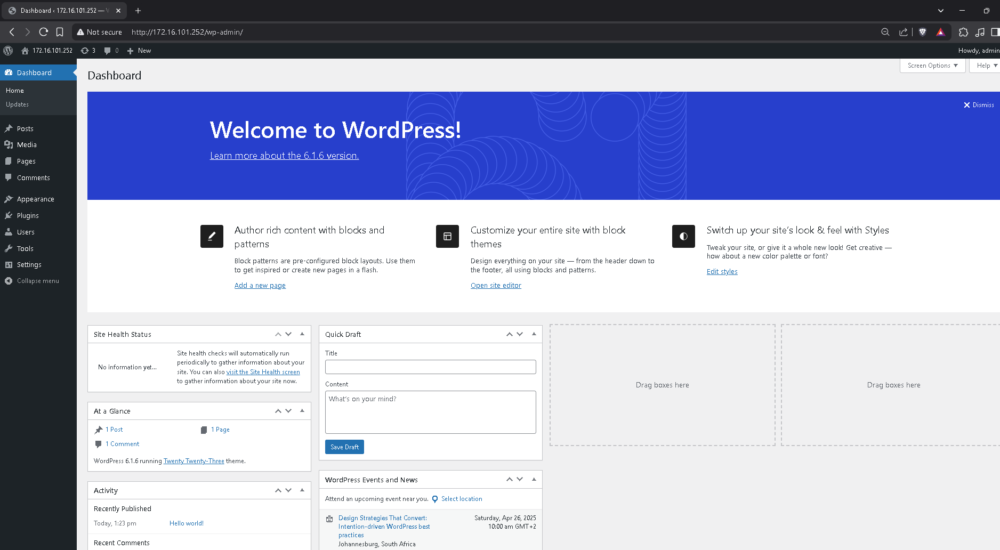

# COS731 FA2
## Topic E. Configuration Management with Ansible, Puppet, or Chef. 

A project related to our third year **[IT diploma network design and administration](https://allqs.saqa.org.za/showQualification.php?id=91927)** studies at **[CTU Training Solutions](https://ctutraining.ac.za/)**. The module is Computer Systems 731, formative assessment 2.In this project project we have implemented agentless configuration management of Linux Virtual Machines on Microsoft Hyper-V through Ansible. 

## Table of Contents

<ul>
 <li><a href="#project-requirements">Project Requirements</a></li>
 <li><a href="#setup">Setup</a></li>
 <li><a href="#run-the-paybooks">Running the Ansible Playbooks</a></li>
 <li><a href="#final-wordpress-steps">Final Wordpress Steps</a></li>
 <li><a href="#differences-between-the-in-class-presentation-and-the-steps-above">Class Presentation Differences</a></li>
 <li><a href="#conclusion">Conclusion</a></li>
</ul>

## Project Requirements
### Host Operating System
- A Microsoft Windows 10 or 11 computer with **[Microsoft Hyper-V Enabled](https://learn.microsoft.com/en-us/windows-server/virtualization/hyper-v/get-started/install-hyper-v?pivots=windows)**. 
- A reliable broadband internet connection without a data cap.
- A minimum of 16GB of memory for the host operating system.
- Recommended minimum of 4 cpu cores and 8 threads. 

### Virtual Machine Images
- Virtual Machine Operating System Fully Automated Installation images, created through **[fai-project.org](https://fai-project.org/FAIme/)** with <a href="/fai_debian_x11_image_additions/">boot scripts</a> or pre-made, downloadable through **[microsoft one drive](https://ctucareerco-my.sharepoint.com/:f:/g/personal/20230254_ctucareer_co_za/EuH9fsd9lTVAnsdlGAD8oX0BhkIOBjqHfTqUnmr0nSTSeA?e=hkIUjv)**. To be placed into the root of the **vm_setup** folder.

## Setup 
### 1. Download Repository and linux images
Download this repository and place the linux images within the *vm_setup* folder. Run powershell as administrator and cd into the *vm_setup* folder. 

## 2. Run the Powershell Scripts. 
Run the scripts in the following order:

> /create_network_interfaces.ps1

> ./create_vm.ps1

If you are using the images from one drive, the username is ansible and the password is ansible1234!

## 3. Windows PC Interface settings

Navigate: Control Panel\Network and Internet\Network and Sharing Centre

<b>*DO NOT SPECIFY A DEFAULT GATEWAY*</b>

## 4. On the management VM
1. Add DNS Server to resolv config

Open the resolv configuration file with the nano text editor
> sudo nano /etc/resolv.conf

Type the following into the text editor: 
> nameserver 1.1.1.1

2. Install ansible, sshpass, and ansible collections

Update apt package list
> sudo apt update

Install ansible, sshpass and git
> sudo apt install ansible sshpass git -y

Install ansible collection collections
> ansible-galaxy collection install ansible.posix community.mysql community.general

### Get the repository on to the Management VM

Option 1: Clone the repository when it is public
> git clone https://github.com/willie-de-klerk/cos731_fa2_project

> cd into cos731_fa2_project

Option 2: Secure Copy Protocol
Download the repository on the windows PC to your Downloads directory, unzip and open powershell.

cd into your download directory. 
> cd Downloads

SCP Command
> scp -r cos731_fa2_project ansible@172.16.101.10:/home/ansible/

## Vault Setup
If you are following along for demonstration purposes, you copy the sample vault values into your actual vault. 
initialize the vault file

> ansible-vault create vault.yml
decrypt the vault file

> ansible-vault decrypt vault.yml
add the example vault file

> cat sample_vault.yml > vault.yml

encrypt the vault file
> ansible-vault encrypt vault.yml

## Run the Paybooks
Ensure you have your vault sorted and encrypted. Ensure you have an internet connection without a data cap or a data cap that you don't care about. 

### 1. Play the Load Balancer book
> ansible-playbook ./playbooks/deploy_lb.yml -i ./inventories/production/hosts/hosts.yml --ask-vault-password

### 2. Play the SQL Server book
> ansible-playbook ./playbooks/deploy_sql.yml -i ./inventories/production/hosts/hosts.yml --ask-vault-password

### 3. Play the Frontend Web book
> ansible-playbook ./playbooks/deploy_fw.yml -i ./inventories/production/hosts/hosts.yml --ask-vault-password

# Final Wordpress steps

## 1. Navigate to the site. 
On your pc navigate to http://172.16.101.252/

## 2. Fill in the information
The site title should remain the same, the rest is your details. 

Press the install wordpress button. Should land here. 

## 3. Login to Wordpress admin Panel

# Differences between the in class presentation and the steps above

In the in class presentation we allowed https access to the demo through **[cloudflare tunnels](https://developers.cloudflare.com/cloudflare-one/connections/connect-networks/)** and a domain that we purchased from **[domains.co.za](https://www.domains.co.za)** for presentations. We also made use of **[microsoft entra id](https://www.microsoft.com/en-us/security/business/identity-access/microsoft-entra-id)** allowing app authentication for our class colleges and teachers. With this configuration, we changed our site title to itdip3projectdemo.xyz, matching our domain.  

To our current understanding, the implementation of cloudflare tunnels may not always be suited to production environments. There are rules and coutnry specific regulations that may be broken if cloudflare tunnels were implemented. 

# Conclusion
Automation tools such as ansible, puppet and chef allow us to implement consistent configuration at scale. This will reduce deployment time, and reduce the amount of human errors made during a deployment. Deployments can also be tested, and placed in a ci/cd pipeline with the addition of github runner and github workflows.  

